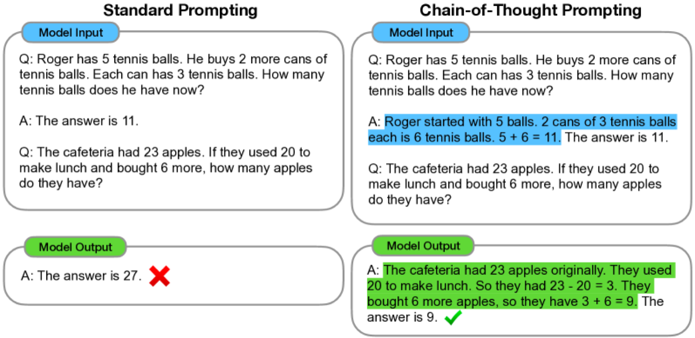
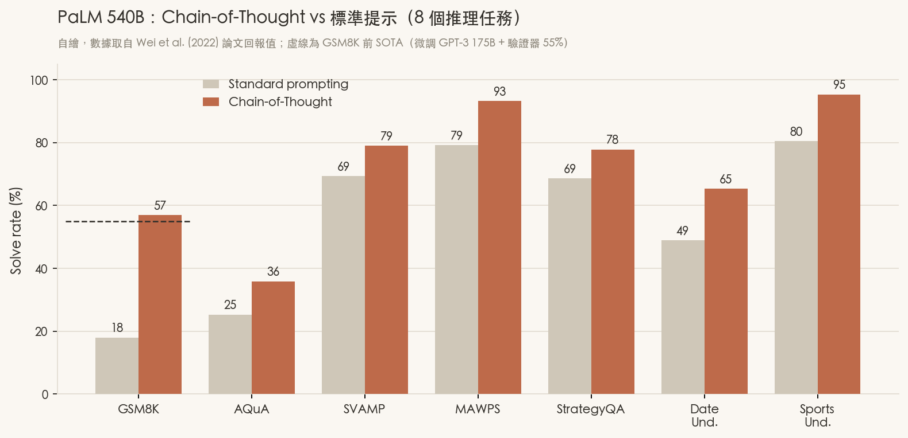
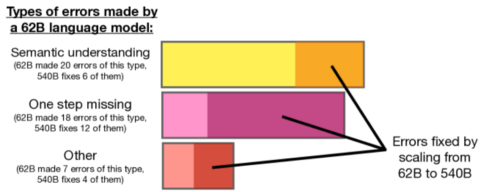

# 📄 Chain-of-Thought Prompting Elicits Reasoning in Large Language Models

> #100篇經典挑戰 No.01 ｜ ⭐⭐⭐⭐⭐ ｜ 2022（NeurIPS 2022）｜ Wei, Wang, Schuurmans, Bosma, Ichter, Xia, Chi, Le, Zhou（Google Research, Brain Team）

| 欄位 | 內容 |
|---|---|
| **作者 / 機構** | Jason Wei、Xuezhi Wang 等 9 人 / Google Research（Brain Team） |
| **發表** | NeurIPS 2022（arXiv:2201.11903，初版 2022/01，v6 2023/01） |
| **連結** | [arXiv abs](https://arxiv.org/abs/2201.11903) · [ar5iv HTML](https://ar5iv.labs.arxiv.org/html/2201.11903) |
| **領域標籤** | `#reasoning` `#prompting` `#emergent-ability` `#in-context-learning` |
| **重要度** | ⭐⭐⭐⭐⭐ — 現代 LLM 推理的「地基第一塊磚」，一個 prompt 技巧就把 GSM8K 從 18 分推到超越當時 SOTA，後面 ReAct、Self-Consistency、Tree of Thoughts 全從這裡長出來 |
| **閱讀狀態** | 精讀 |

> 這是我「AI Agent 經典論文」清單的第一篇。挑它當開場不是沒有原因——**現代 agent 迴圈的第一個字「Reason」就是這篇奠定的**。在它之前，大家默認「要模型會算數學，就得拿標註資料去 fine-tune」；這篇用一個近乎作弊的簡單手法證明：**不動一根權重，只要在 few-shot 範例裡「示範怎麼想」，夠大的模型就會跟著一步步推理，然後答對**。做法簡單到令人髮指，但它掀開的是「推理是規模的湧現能力」這整條研究線。

---

## 🟢 第一層：是什麼（30 秒電梯簡報）

- **一句話總結**：這篇提出 **Chain-of-Thought（CoT，思維鏈）prompting**——在 few-shot 範例裡，除了給「問題→答案」，還把中間**推理過程**也寫出來當示範；模型於是在作答前先自己吐出一串推理步驟，複雜推理正確率大幅提升。**完全不需要訓練或微調，純提示。**
- **痛點（Before）**：LLM 在「一步到位」的任務（翻譯、分類）很行，但碰到**多步推理**（數學應用題、常識推論）就崩。當時要救它，主流是兩條路——(1) 花錢標一堆「題目+完整解題步驟」去 fine-tune；(2) 硬 scale 模型，但論文自己也承認「單純放大模型，在算術/常識/符號推理上幾乎沒有平滑增益」。兩條路都貴。
- **核心洞見（Aha moment）**：**把「解題過程」當成 prompt 的一部分示範給模型看**，模型就會模仿這種「先拆步驟、再給答案」的行為。作者的類比很傳神——這就像人類算應用題時，不會直接報答案，而是「在草稿紙上一步步算」。CoT 等於是**逼模型也用一張草稿紙**。關鍵是：這能力**只有夠大的模型才有**（約 100B 參數以上才明顯），小模型模仿的推理「文句通順但邏輯不通」，反而更差。
- **成果（After）**：PaLM 540B 在 **GSM8K**（小學數學應用題）用 CoT 從標準提示的 **17.9% 一舉衝到 56.9%**（約 3.2×），並**超越當時的 SOTA**——一個用了驗證器（verifier）的微調 GPT-3 175B（55%）。也就是說：**一個 prompt 技巧，打贏了「微調 + 額外驗證模型」的整套重裝方案。**

> 金句：**"chain-of-thought reasoning is an emergent ability of increasing model scale."**

---

## 🟢 第二層：怎麼做（方法拆解）

### 核心方法

方法本體幾乎沒有「方法」——它是一種 prompt 格式。對照一下就懂：

```text
【標準 few-shot 提示】
Q: Roger 有 5 顆網球，又買了 2 罐、每罐 3 顆。現在他有幾顆？
A: 答案是 11。
Q: <新問題>
A:  → 模型直接猜一個數字（常錯）

【Chain-of-Thought 提示】
Q: Roger 有 5 顆網球，又買了 2 罐、每罐 3 顆。現在他有幾顆？
A: Roger 一開始有 5 顆。2 罐 × 每罐 3 顆 = 6 顆。5 + 6 = 11。答案是 11。   ← 把「怎麼想」也寫進範例
Q: <新問題>
A:  → 模型模仿，先輸出一串推理步驟，最後才給答案（正確率大增）
```

差別只有一處：**範例的答案欄，從「一個數字」換成「一段自然語言推理 + 數字」。** 就這樣。不改架構、不改權重、不加解碼器，測試時模型自己會在 `A:` 後面生成整串思維鏈，答案就藏在最後一句。


**Figure 1**　全篇的靈魂圖。左邊「標準提示」範例只示範了答案（11），模型面對新題直接報一個數字 → 錯（27）。右邊「CoT 提示」在範例裡把推理過程（藍字）也寫出來，模型面對新題就跟著一步步算（綠字）→ 對（9）。看兩邊唯一的差異就在範例答案有沒有「過程」。

### 這套方法為什麼值得做（作者列的四個賣點）

1. **把難題拆成中間步驟**，等於給模型更多「算力預算」去處理需要多步的題目。
2. **可解釋**——你看得到它「怎麼算到這個答案」，錯在哪一步也看得出來（雖然作者也誠實說：它不保證真的反映模型內部運算）。
3. **適用面廣**——只要是人類「能用語言一步步講清楚」的任務（數學、常識、符號操作）原則上都能用。
4. **零成本上手**——任何現成的大模型，把 few-shot 範例改成 CoT 格式就行，不需要重訓。

### 實驗怎麼驗證

- **模型（跨 5 個家族、涵蓋 350M→540B）**：GPT-3（350M/1.3B/6.7B/175B）、LaMDA（422M/2B/8B/68B/137B）、PaLM（8B/62B/540B）、UL2 20B、Codex（code-davinci-002）。用這麼寬的規模帶，就是為了畫出「能力 vs 規模」的曲線。
- **範例數（k-shot）**：算術任務用 **8 個**手寫 CoT 範例；AQuA（選擇題）用 **4 個**；常識/符號推理用 **6–10 個**。範例是人工寫的，全篇沒有訓練。
- **對照組（baselines）**：同一個模型的**標準 few-shot 提示**（範例只有答案、沒有過程）；GSM8K 另外對比當時 SOTA——微調 GPT-3 175B + 訓練一個驗證器重排答案（55%）。
- **三大類任務**：
  - **算術**：GSM8K、SVAMP、ASDiv、AQuA、MAWPS。
  - **常識**：CommonsenseQA、StrategyQA、Date Understanding、Sports Understanding。
  - **符號**：Last Letter Concatenation（取字首串接）、Coin Flip（追蹤硬幣正反面）。

### 精確結果（PaLM 540B，標準 → CoT）


**Figure 2**　（自繪，數據取自論文回報值）八個推理任務上，CoT（紅）幾乎全面輾壓標準提示（灰）。**GSM8K 是最戲劇性的一格**：18 → 57，直接翻過那條虛線（前 SOTA「微調 + 驗證器」的 55）。愈是「需要多步推理」的任務（GSM8K、Date、Sports），CoT 拉開的差距愈大；愈接近「一步到位」的任務（ASDiv 72→74）增益就小。

| 任務 | 類型 | 標準 | CoT | 提升 |
|---|---|---|---|---|
| **GSM8K** | 算術 | 17.9% | **56.9%** | +39.0（超越 SOTA 55%） |
| SVAMP | 算術 | 69.4% | 79.0% | +9.6 |
| ASDiv | 算術 | 72.1% | 73.9% | +1.8 |
| AQuA | 算術（選擇題） | 25.2% | 35.8% | +10.6 |
| MAWPS | 算術 | 79.2% | 93.3% | +14.1 |
| StrategyQA | 常識 | 68.6% | 77.8% | +9.2 |
| Date Understanding | 常識 | 49.0% | 65.3% | +16.3 |
| Sports Understanding | 常識 | 80.5% | 95.4% | +14.9 |
| CommonsenseQA | 常識 | 78.1% | 79.9% | +1.8 |
| Last Letter Concat.（in-domain） | 符號 | 7.6% | **99.4%** | +91.8 |
| Coin Flip（in-domain） | 符號 | 98.1% | 100.0% | +1.9 |

> 符號任務的 Last Letter（7.6 → 99.4）看起來誇張，重點在**長度外推**：範例是 2 個詞，測試時換成 3、4 個詞，CoT 仍能靠「一步步取字首」的推理泛化過去，而標準提示直接崩。

### 🔑 最關鍵的發現：CoT 是「規模的湧現能力」

這是全篇我認為最重要、也最常被引用的結論：**CoT 在約 100B 參數以下幾乎沒用，甚至有害；過了門檻才突然「開竅」。** 論文原話：*"chain-of-thought prompting does not positively impact performance until used with models of ∼100B parameters."* 小模型會生出**「文句通順但邏輯不通」**的推理鏈，反而拖低分數。這條「能力隨規模非線性跳升」的觀察，直接催生了後來 Wei 等人另一篇專論 **Emergent Abilities of LLMs**。

### Ablation：到底是「哪個零件」在起作用？（§3.3，LaMDA 137B & PaLM 540B on GSM8K）

作者很小心地排除「其實是別的因素在幫忙」的三種替代解釋：

| 變體 | 做法 | 結果 | 說明了什麼 |
|---|---|---|---|
| **Equation only（只給算式）** | 範例只放數學式，不放自然語言推理 | 對 GSM8K **幾乎沒幫助** | 光有符號式不夠——語意複雜的題目需要**自然語言**把關係想清楚 |
| **Variable compute only（只給等長的點點）** | 用一串「…」佔位，長度等同 CoT，但沒有內容 | ≈ baseline | 增益**不是**因為「多花了算力/更多 token」 |
| **Chain of thought after answer（先答再解釋）** | 先輸出答案，再寫推理 | ≈ baseline | 增益**不是**因為「啟動了相關知識」；真正有效的是**作答前的循序推理過程本身** |

> 這組 ablation 是全篇的功臣。它把「CoT 有效」精準歸因到**「在給答案之前，按順序生成推理步驟」**這件事，而不是「更多算力」「更多 token」或「知識被喚醒」。

### 穩健性（Robustness）

- **不同標註者**：三位作者各自獨立寫 CoT 範例，三套都「大幅」贏過標準提示（雖然彼此有差異）。
- **不同範例來源**：從 GSM8K 訓練集**隨機抽**的範例，效果與精心手寫的相當，一樣顯著贏過標準提示 → 表示不靠「範例寫得特別好」。
- **範例順序/數量**：跨 5 個隨機種子的標準差在幾乎所有任務都很小（除了 coin flip）；改變 few-shot 範例數，增益大致仍在。


**Figure 3**　把 62B 模型的錯誤歸成三類（語意理解錯、漏一步、其他），統計「放大到 540B 後修好幾個」。可以看到**規模放大主要修好的是「語意理解」與「漏步驟」這類推理錯誤**——這正呼應了「CoT 是規模湧現能力」：更大的模型才有本錢把多步推理走完不出錯。

---

## 🟢 第三層：對我而言（帶走什麼）

- **我為什麼讀這篇**：它是 AI Agent 迴圈 `think → act → observe` 裡「think」的原點。要理解 ReAct 為何把「推理」和「行動」交錯、Self-Consistency 為何要對「多條推理鏈」投票，得先懂 CoT 到底提供了什麼。
- **可以直接借用的點子**：
  1. **「示範過程，而非只示範結果」**——不只 LLM，設計任何 few-shot / in-context 任務時，把「中間推理」塞進範例往往比堆更多「輸入→輸出」對更有效。
  2. **想驗證「是哪個零件在起作用」，就做「等長佔位」與「順序對調」這種 ablation**——這招（variable-compute-only、after-answer）拿來檢驗自己的系統非常好用。
  3. **能力有規模門檻**——別在小模型上驗證「推理型」技巧然後判死刑，可能只是還沒到湧現門檻。
- **金句**：
  > "We show how such reasoning abilities emerge naturally in sufficiently large language models via a simple method called chain of thought prompting."
- **相關論文**：`[[ReAct]]` `[[Self-Consistency]]` `[[Tree of Thoughts]]` `[[Zero-shot CoT (Let's think step by step)]]` `[[STaR]]` `[[Emergent Abilities of LLMs]]`

---

## 🔵 深入欄位

### 批判性思考（不要只當粉絲）

- **可解釋性是打折的**：作者自己也承認，模型吐出的思維鏈**不保證真的反映它內部的計算路徑**——它可能「答對了但推理是編的」，或「推理看似合理但根本是事後合理化」。CoT 給的是「像人類推理的文字」，不是「模型真實的運算軌跡」。這個坑後來被 faithfulness 相關研究一路追打。
- **人工手寫範例是隱藏成本**：號稱「零成本」，但每個任務仍要人工寫 8~10 個高品質 CoT 範例。這個痛點正是後續 **Zero-shot CoT（"Let's think step by step"）** 和 **Auto-CoT** 想拔掉的。
- **對規模的依賴是雙面刃**：結論漂亮，但也等於說「小模型與你無緣」。這在 2022 是現實限制；不過後來蒸餾（distillation）與更好的訓練配方，讓小模型也逐漸能 CoT，門檻在鬆動。
- **只涵蓋「能用語言講清楚」的推理**：需要精密符號操作、長程狀態追蹤的任務，純文字 CoT 仍會累積誤差——這也是後來要外接工具（PAL、Program-of-Thoughts、ReAct 呼叫計算器/檢索）的動機。

### 名詞速查

- **Chain of Thought（思維鏈）**：模型在給最終答案前，先生成的一串中間推理步驟（自然語言）。
- **Few-shot / In-context learning**：不更新權重，只在 prompt 裡塞幾個示範例，讓模型「照樣造句」。
- **Emergent ability（湧現能力）**：小模型看不到、模型放大過某門檻後才「突然出現」的能力，隨規模非線性跳升。
- **GSM8K**：Grade School Math 8K，8500 題小學數學應用題，需要多步算術，是推理難度的試金石。
- **Verifier（驗證器）**：前 SOTA 方案用的額外模型，對候選答案打分重排；CoT 不用它就贏了。

---

## ✅ 結尾

**歷史定位**　這是「LLM 推理」這條路的**開山第一鏟**，繼承自 Nye 等人的 **Scratchpad**（讓模型把中間計算寫出來）與 Cobbe 等人的 **GSM8K + verifier**，但把「要靠訓練」變成「只靠提示」。它往下直接啟發了一整代：**Zero-shot CoT**（連範例都省了，一句 "Let's think step by step"）、**Self-Consistency**（對多條 CoT 投票）、**Tree of Thoughts / LATS**（把線性思維鏈擴成搜尋樹）、以及 agent 的 **ReAct**（推理鏈中插入行動）。可以說，2022 之後幾乎每一篇談「LLM 怎麼想」的論文，引言都要先點名這篇。

**延伸閱讀**
- 往前補讀：`[[Scratchpad (Nye et al., 2021)]]`、`[[Cobbe et al. 2021 GSM8K + Verifier]]`
- 往後追：`[[Zero-shot CoT (Kojima et al., 2022)]]`、`[[Self-Consistency (Wang et al., 2022)]]`、`[[Tree of Thoughts (Yao et al., 2023)]]`、`[[ReAct (Yao et al., 2022)]]`、`[[STaR (Zelikman et al., 2022)]]`、`[[Emergent Abilities of LLMs (Wei et al., 2022)]]`

**展望 / 我的判斷**　CoT 真正的貢獻不是那個 prompt 技巧本身（技巧很快被 Zero-shot CoT 用一句話取代），而是它**證明了「推理」是可以從大模型裡『引導』出來、而非只能『訓練』進去的**——這個觀念轉向才是護城河。它也埋下三顆種子，全都長成了大樹：(1)「先想再答」→ 演化成 test-time compute / inference scaling（今天 o1、R1 這條線的思想源頭）；(2)「多步推理會累積誤差」→ 逼出工具使用與 agent；(3)「能力隨規模湧現」→ 開啟 emergent abilities 的討論。我認為**最難被複製的，不是 CoT，而是它示範的那種「用極簡對照實驗，把一個大現象歸因到一個小機制」的研究品味**——那組 ablation 至今仍是我心中 prompting 論文的教科書範例。
