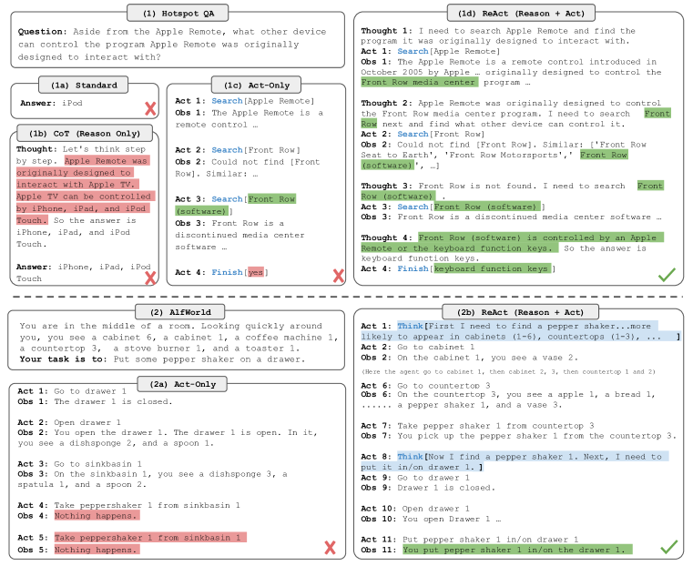
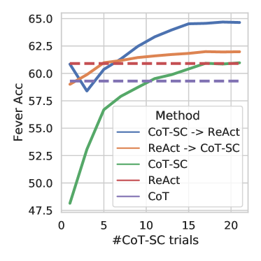
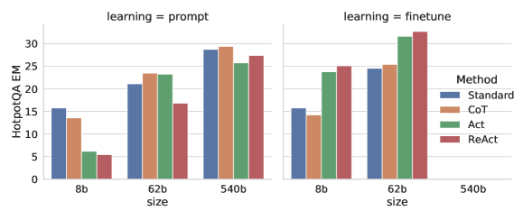

# 🔁 ReAct: Synergizing Reasoning and Acting in Language Models（讓 LLM 交錯輸出「推理」與「行動」，邊想邊查、邊做邊修）

> #100篇經典挑戰 No.02 ｜ ⭐⭐⭐⭐⭐ ｜ Yao et al., 2022（ICLR 2023）

| 欄位 | 內容 |
|---|---|
| **作者 / 機構** | Shunyu Yao、Jeffrey Zhao、Dian Yu、Nan Du、Izhak Shafran、Karthik Narasimhan、Yuan Cao / Princeton、Google Research（Brain Team） |
| **發表** | ICLR 2023（arXiv:2210.03629，初版 2022/10） |
| **連結** | [arXiv abs](https://arxiv.org/abs/2210.03629) · [ar5iv HTML](https://ar5iv.labs.arxiv.org/html/2210.03629) · [專案頁](https://react-lm.github.io/) |
| **領域標籤** | `#agent` `#reasoning` `#tool-use` `#prompting` |
| **重要度** | ⭐⭐⭐⭐⭐ — 定義了現代 agent 的基本迴圈（think → act → observe），是工具使用與 agent 框架的共同起點 |
| **閱讀狀態** | 精讀 |

ReAct 是一種提示方法，讓 LLM 在解題時**交錯生成「推理軌跡（reasoning trace）」與「行動（action）」**：推理用來規劃、追蹤、處理例外；行動則透過外部工具（如 Wikipedia API 或環境）取得資訊。相較於只推理（CoT）或只行動（Act-only），兩者交錯能互補——推理指導行動、行動用外部事實校正推理。以 PaLM-540B 為基礎、僅用 1~6 個 few-shot 範例，在知識推理與互動決策兩類任務上皆超越既有方法。

---

## 問題與核心貢獻

- **痛點（Before）**：
  - **推理（CoT）與行動（action plan generation）過去是兩條分開的研究線**。
  - 只推理（CoT）：全靠模型內部知識，缺乏外部依據，容易產生**幻覺（hallucination）與錯誤傳播**。
  - 只行動（Act-only）：能操作環境但**缺乏高階規劃**，難以拆解目標、追蹤狀態、彙整答案。
- **核心洞見（Aha）**：把「語言推理」也納入 agent 的**行動空間**——讓模型可以選擇「產生一個想法」或「執行一個動作」，兩者交錯。
  - 想法（thought）不改變環境，只更新 context，用來支持後續推理或行動。
- **核心貢獻**：
  - 提出 ReAct 這個交錯推理與行動的通用提示範式；
  - 在知識推理（HotpotQA、FEVER）與互動決策（ALFWorld、WebShop）兩類任務上驗證；
  - 顯示行動能**降低幻覺**、推理能**提升決策成功率與可解釋性**。
- **成果（After）**：
  - ALFWorld 成功率比模仿學習 baseline（BUTLER）高 **+34% 絕對值**；
  - WebShop 比 IL+RL baseline 高 **+10% 絕對值**；
  - 皆僅用 1~2 個 in-context 範例。


**Figure 1**　同一題（上：HotpotQA；下：ALFWorld）在四種方法下的軌跡對比。(1a) Standard 直接給答案；(1b) CoT 只推理、內部知識出錯（紅）；(1c) Act-only 只有動作、缺乏規劃而失敗；(1d) ReAct 交錯 Thought / Act / Obs，邊查 Wikipedia 邊修正推理 → 答對。

---

## 方法拆解

- **行動空間擴充**：把原本的行動集合 𝒜 擴成 𝒜̂ = 𝒜 ∪ ℒ，其中 ℒ 是自由形式語言（想法）。模型每步可選擇輸出一個「想法」或一個「動作」。
- **一個回合的節奏**：`Thought`（推理/規劃）→ `Action`（呼叫工具）→ `Observation`（工具回傳）→ 再 Thought…，循環到 `finish`。
- **知識任務的動作空間（Wikipedia API）**：
  - `search[entity]`：回傳該實體維基頁前 5 句，或前 5 個相似實體；
  - `lookup[string]`：回傳頁面中下一個含該字串的句子（模擬 Ctrl+F）；
  - `finish[answer]`：提交答案。
- **兩類任務的想法密度不同**：
  - 知識推理（HotpotQA/FEVER）：**密集想法**——幾乎每個動作前都先想一句；
  - 互動決策（ALFWorld/WebShop）：**稀疏想法**——只在需要規劃/重估時插入想法，其餘步驟直接行動。
- **prompt 形式**：由人工在動作之上標註自由形式的推理文字，作為 few-shot 範例。
- **基礎模型**：主要用 **PaLM-540B**（凍結，只做提示）；另有 GPT-3（text-davinci-002）與微調實驗。

```text
Thought 1: 我要先查 Apple Remote 原本設計來控制什麼程式。
Act 1: search[Apple Remote]
Obs 1: Apple Remote ... 原設計用來控制 Front Row media center 程式 ...
Thought 2: 接著查 Front Row 還能被什麼裝置控制。
Act 2: search[Front Row]
Obs 2: 找不到 Front Row。相似：['Front Row (software)', ...]
Thought 3: 改查 Front Row (software)。
Act 3: search[Front Row (software)]
Obs 3: ... 可由 Apple Remote 或鍵盤功能鍵控制 ...
Thought 4: 答案是鍵盤功能鍵。
Act 4: finish[keyboard function keys]
```

---

## 實驗與結果

- **知識推理**：HotpotQA（多跳問答）、FEVER（事實查核）。few-shot：HotpotQA 6 個、FEVER 3 個。
- **互動決策**：ALFWorld（文字冒險，家務任務）、WebShop（網購導航）。few-shot：ALFWorld 3 條軌跡、WebShop 1~2 個。

### 知識推理：ReAct 與 CoT 各有所長，合用最好

- 單獨看，ReAct 的 HotpotQA EM 不見得贏 CoT-SC（ReAct 27.4 vs CoT-SC 33.4）——因為檢索到不相關資訊會干擾推理。
- 但**把兩者結合**（需要外部事實時用 ReAct、需要內部知識時退回 CoT-SC）效果最好。

| 方法（PaLM-540B） | HotpotQA EM | FEVER Acc |
|---|---|---|
| Standard | 28.7 | 57.1 |
| CoT | 29.4 | 56.3 |
| CoT-SC（self-consistency） | 33.4 | 60.4 |
| Act-only | 25.7 | 58.9 |
| ReAct | 27.4 | 60.9 |
| CoT-SC → ReAct | 34.2 | 64.6 |
| **ReAct → CoT-SC** | **35.1** | 62.0 |


**Figure 2**　FEVER 準確率 vs CoT-SC 取樣次數。兩條結合方法（ReAct↔CoT-SC）隨取樣增加穩定超越單用 CoT-SC（綠）、CoT（紫虛線）與 ReAct（紅虛線）。

### 互動決策：大幅超越模仿/強化學習

- **ALFWorld**：ReAct 最佳成功率 **71%**，Act-only 45%，BUTLER（模仿學習）37% → 比 BUTLER **+34% 絕對值**。
- **WebShop**：ReAct **40.0%**，Act 30.1%，IL 29.1%，IL+RL 28.7% → 比 IL+RL **+10% 絕對值**。

| 基準 | 指標 | ReAct | Act-only | 學習式 baseline |
|---|---|---|---|---|
| ALFWorld（全任務） | 成功率 | **71%** | 45% | BUTLER 37% |
| WebShop | 成功率 | **40.0%** | 30.1% | IL+RL 28.7% |

### 分析：行動如何抑制幻覺（HotpotQA 人工分析 200 例）

| 指標 | ReAct | CoT |
|---|---|---|
| 成功案例中的幻覺率（false positive） | 6% | 14% |
| 以「幻覺」為失敗主因的比例 | 0% | 56% |
| 以「推理錯誤」為失敗主因 | 47% | 16% |
| 檢索到錯誤資訊 | 23% | — |

- **CoT 的主要失敗模式是幻覺（56%）**；ReAct 幾乎不因幻覺失敗（0%），因為行動會用外部事實校正推理。
- ReAct 的失敗多來自「推理錯誤」或「檢索到不相關結果」——這是接上外部工具後的新失敗類型。

### 微調實驗（HotpotQA）

- 用 3,000 條正確軌跡自舉（bootstrap），微調 PaLM-8B / 62B。
- 微調後 ReAct 全面優於 Standard/CoT/Act；且**微調 ReAct 的 PaLM-62B 勝過所有提示法的 PaLM-540B**。


**Figure 3**　HotpotQA EM 隨模型規模變化。左（提示）：540B 時各法接近；右（微調）：ReAct（紅）在 62B 明顯領先其他方法，顯示小模型微調 ReAct 即可超越大模型提示。

---

## 可借鑑之處

- **可借用 / 可復用的方法點**：
  1. 把「推理」視為行動空間的一員（thought 作為不改變環境的內部動作），是 think→act→observe 迴圈的通用寫法。
  2. 行動接外部工具（檢索/環境）可將推理「接地（grounding）」，是降低幻覺的實用手段。
  3. 按任務調整想法密度：需要多步規劃時密集想、環境明確時稀疏想。
  4. ReAct 與 CoT-SC 依「該靠外部事實或內部知識」動態切換，可取兩者之長。
- **適用場景**：需要邊查資料/邊操作環境、且要求可解釋軌跡的問答與決策任務。

---

## 局限與延伸

1. **檢索品質是瓶頸**：接上簡單 Wikipedia API 後，「檢索到不相關資訊」成為新的主要失敗來源（HotpotQA 佔 23%）。
2. **單獨的 ReAct 未必贏 CoT-SC**：在純知識問答上需與 CoT-SC 結合才明顯領先，說明外部行動並非萬用。
3. **few-shot 軌跡需人工標註**：推理+行動的示範需人工撰寫，換領域要重寫。
4. **提示法在最大模型上增益收斂**：HotpotQA 在 540B 提示時各法差距縮小，明顯優勢較多出現在微調或決策任務。

### 名詞速查

| 名詞 | 一句白話 |
|---|---|
| **ReAct** | Reasoning + Acting，交錯輸出推理與行動的提示範式 |
| **Reasoning trace（推理軌跡）** | 模型輸出的中間思考文字（thought），用來規劃與追蹤，不改變環境 |
| **Action space（行動空間）** | agent 可執行的動作集合；ReAct 把「自由語言想法」也納入其中 |
| **Grounding（接地）** | 用外部工具/環境的真實回饋來校正模型輸出，抑制幻覺 |
| **ALFWorld / WebShop** | 文字家務任務 / 網購導航，兩個互動決策 benchmark |
| **CoT-SC** | Chain-of-Thought Self-Consistency，對多條 CoT 取樣後投票 |

---

## 歷史定位與展望

- **歷史定位**：
  - 前作：`[[Chain-of-Thought Prompting (Wei et al., 2022)]]`（提供「推理」一半）、`[[Self-Consistency (Wang et al., 2022)]]`（ReAct 與之結合）、以及 WebGPT / SayCan 等「行動」方向工作。
  - 啟發：定義了 think→act→observe 迴圈，成為後續 agent 與工具使用框架的共同基礎，`[[Reflexion (Shinn et al., 2023)]]`、`[[Voyager (Wang et al., 2023)]]` 等皆在此迴圈上加入記憶/技能。
- **延伸閱讀**：
  - 往前：`[[Chain-of-Thought Prompting (Wei et al., 2022)]]`、`[[Self-Consistency (Wang et al., 2022)]]`
  - 往後：`[[Reflexion (Shinn et al., 2023)]]`、`[[Voyager (Wang et al., 2023)]]`、`[[Toolformer (Schick et al., 2023)]]`
- **展望**（依論文與後續發展）：
  - 「推理 + 行動」交錯成為 agent 的標準迴圈，後續工作多在其上補上記憶、反思、技能庫、多工具編排；
  - 檢索/工具品質與軌跡標註成本，成為後續改進的主要方向。
